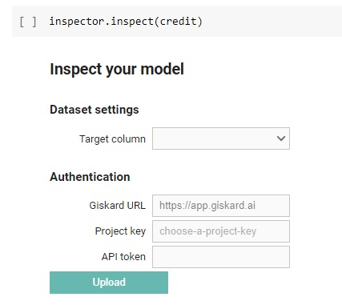

# Upload your model

### Quick start

To get started with Giskard as fast as possible we've included a demo python notebook to Giskard.  Feel free to modify it to adapt it to your case!

After running [docker-compose up -d](requirements.md) a python notebook is started automatically on [**http://localhost:18888/**](http://localhost:18888)****

This notebook already has `ai-inspector` installed and you may follow it to see how the models are uploaded to Giskard.&#x20;

In order to upload the model you'll need to generate an API key from Giskard -> user profile page.


A demo notebook is also available [here](https://github.com/Giskard-AI/giskard/blob/main/backend/demo-notebook/notebook/German\_credit\_scoring\_giskard.ipynb)


### Prerequisites

In order to upload models and datasets to Giskard there needs to be an additional package installed in the environment where you train the models:


`pip install ai-inspector`


To upload the model you want to inspect, you need:

* A model. For example, a scikit-learn predict\_proba function
* A pandas dataframe composed of the examples you want to inspect. For example, it could be your test dataset or a dataset composed of some wrong predictions of your model
* The Giskard's platform. To install it, check [requirements.md](requirements.md "mention")

Here are the two steps to inspect your model:

### 1. Create a ModelInpsector object

`ModelInpector` Python class has the following argument

| Argument                   | Description                                                                                                                                                                                                                                                                               | Type                                                                    |
| -------------------------- | ----------------------------------------------------------------------------------------------------------------------------------------------------------------------------------------------------------------------------------------------------------------------------------------- | ----------------------------------------------------------------------- |
| `prediction_function`      | The model you want to predict. It could be any Python function with the signature of [predict\_proba](https://scikit-learn.org/stable/modules/generated/sklearn.linear\_model.LogisticRegression.html#sklearn.linear\_model.LogisticRegression.predict\_proba) function from scikit-learn | <p>Callable[</p><p>[pd.DataFrame], Iterable[Union[str, float, int]]</p> |
| `prediction_task`          | <ul><li>"classification" for classification model</li><li>"regression" for regression model</li></ul>                                                                                                                                                                                     | str                                                                     |
| `input_types`              | A dictionary of feature names with their types: `numeric`, `category` or `text`                                                                                                                                                                                                           | Dict\[str, str]                                                         |
| `classification_threshold` | The probability threshold of your classification model. By default, it's equal to 0.5                                                                                                                                                                                                     | Optional\[float] = 0.5                                                  |
| `classification_labels`    | The classification label of your target variable.                                                                                                                                                                                                                                         | Optional\[List\[str]] = None                                            |

### 2. Inspect a dataset

To inspect your pandas dataframe, you need to use the `inspect` function It opens the following widget



Then you need to choose,

* **Target column**: it's the target variable in your dataset
* **Giskard UR**L: if Giskard is hosted locally, it should be `http://localhost:19000`
* **Project key**: choose a project name you like. You can upload different model versions and datasets in the same project
* **API token**: you can generate your API token in the Admin tab of Giskard (login: `admin` ;  password: `admin` at `http://localhost:19000` if hosted locally)


If you don't want to use the widget or for custom upload, you can use the _upload\_model, upload\_df, or upload\_and\_df functions. For more detail, check the_ [_ModelInspector_](https://github.com/Giskard-AI/ai-inspector/blob/main/ai\_inspector/inspector.py#L34) _class_


## Example

```python
from ai_inspector import ModelInspector

inspector = ModelInspector(
    prediction_function= clf.predict_proba,
    prediction_task="classification",
    input_types=input_types = {
               'account_check_status':"category", 
               'duration_in_month':"numeric",
               'credit_history':"category",
               'purpose':"category",
               'credit_amount':"numeric"
               }
    classification_labels=["Not default","Default"],
)

inspector.inspect(credit)
```

## More details,

To contribute, check our [Github repository](https://github.com/Giskard-AI/ai-inspector)
